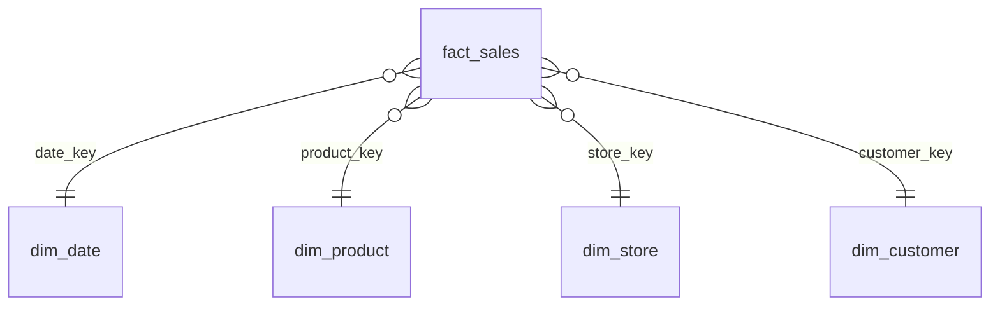

# DAX Measures Library

**Production-ready DAX patterns for Power BI, organised by use case. Each measure has its purpose, the code, and an example output computed on a real (synthetic) model, so you can check your own results.**

All examples use the star schema from **[sales-intelligence-powerbi](https://github.com/Shashan4321/sales-intelligence-powerbi)** (`fact_sales`, `dim_date`, `dim_product`, `dim_store`, `dim_customer`). The example outputs are the values that model returns on its seeded synthetic data (2023-2025, INR), and they are cross-checked against SQL in that repo's [`expected_measure_values.md`](https://github.com/Shashan4321/sales-intelligence-powerbi/blob/main/reports/expected_measure_values.md).

## Contents

| # | Category | Patterns |
|---|---|---|
| 01 | [Base measures](measures/01-base-measures.md) | Revenue (returns excluded), Orders, AOV, Gross Margin %, Discount %, Return Rate % |
| 02 | [Time intelligence](measures/02-time-intelligence.md) | PY, **YoY %** (blank-safe), PM, **MoM %**, **YTD/QTD/MTD**, YTD vs PY, **Indian FY (Apr-Mar) FYTD** |
| 03 | [Running totals & rolling](measures/03-running-totals-and-rolling.md) | All-time running total, running total that resets each year, 3-month rolling average |
| 04 | [Ranking & Top N](measures/04-ranking-and-top-n.md) | RANKX, dynamic Top N (what-if), Pareto cumulative %, share of parent in a drill-down |
| 05 | [Customer analytics](measures/05-customer-analytics.md) | Active, **new** and returning customers |
| 06 | [Semi-additive](measures/06-semi-additive-inventory.md) | Closing stock, LASTNONBLANK balances |
| 07 | [Row-level security](measures/07-row-level-security.md) | Static RLS, **dynamic RLS** with USERPRINCIPALNAME, manager-hierarchy RLS with PATH |
| 08 | [Calculation groups & what-if](measures/08-calculation-groups-and-what-if.md) | Time-intelligence calc group, price scenario, KPI selector, crore/lakh dynamic format |

Everything in one file: [`all-measures.dax`](all-measures.dax).

## Model

## Conventions

* `DIVIDE()` instead of `/`, so a zero denominator returns BLANK instead of an error.
* Variables (`VAR`) for readability and so each expression is evaluated once.
* Business rules (exclude returns, distinct orders) live in the base measures only; everything else references them.
* Growth measures return BLANK when there is no comparison period, instead of misleading ±100% values.
* Formatted with [DAX Formatter](https://www.daxformatter.com) conventions.

## Example: the numbers behind the patterns (2025)

| Measure | Value |
|---|---:|
| Total Revenue | ₹1,584,825,489 (₹158.48 Cr) |
| Revenue YoY % | +32.1% |
| Revenue MoM %, Oct-2025 | +57.4% |
| Revenue YTD at 30-Jun-2025 vs PY | +43.7% |
| Revenue FYTD, FY2025 | ₹1,306,245,651 |
| New / returning customers | 1,614 / 1,579 |
| Top category share (Pareto) | Electronics 68.4% |

## Author

**Shashank Singh**, Senior Data Analyst / Power BI Developer · [Portfolio](https://shashan4321.github.io) · [LinkedIn](https://www.linkedin.com/in/shashank-moon)

*Data:* all example values come from synthetic data. No employer or client data, table names or code are used.
